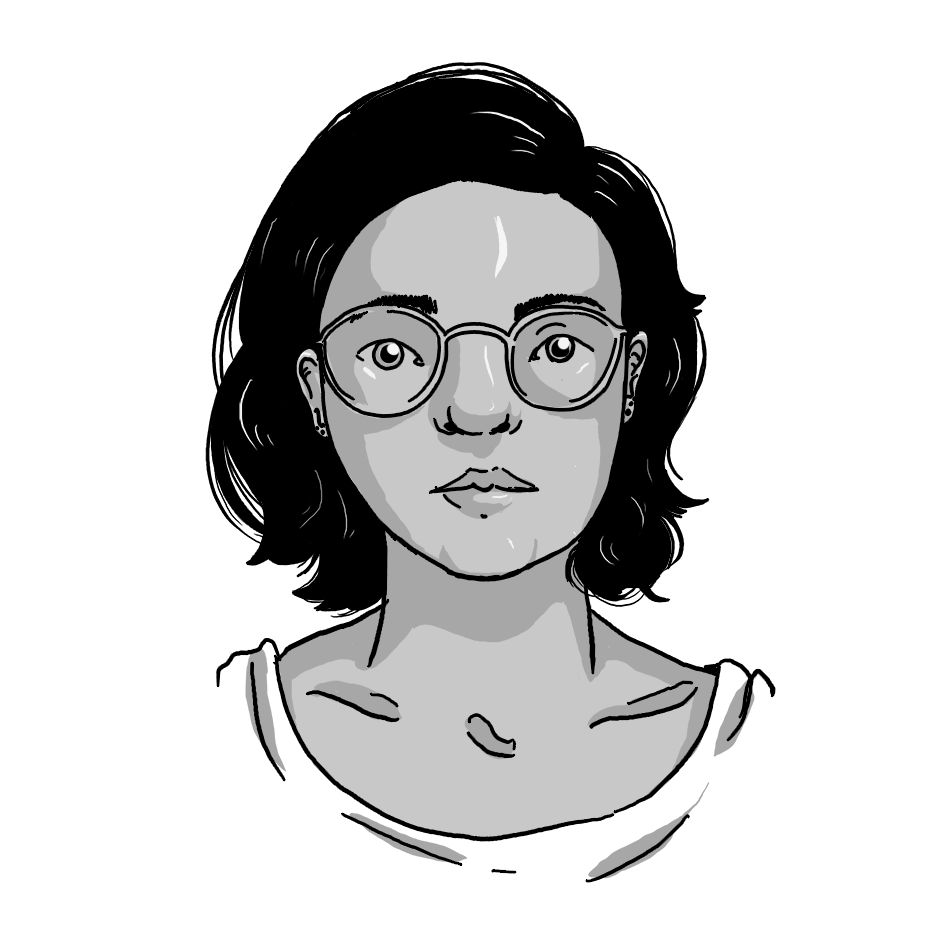

  <h3>
    designer • desenvolvedora • ilustradora
  </h3>
  

    
  

  

    

      Formada em Design pela PUC-Rio, comecei a trabalhar com design gráfico em 2012 no Estúdio Pira, quando saí para fazer 1 ano de Iniciação Científica.
      Ao longo de 2013 projetei o TattooAR, aplicativo de realidade aumentada para tatuagens, apresentado em 2015 na Conferência HCI (Human-Computer Interaction) Internacional em Los Angeles - CA.
    

    

      Participei da Apple Academy em 2015. A bolsa, parceria da PUC-Rio com a Apple, ensina desenvolvimento de aplicativos em Objective-C e Swift. Com o conhecimento adquirido no programa, eu ganhei o Schorlarship para as WWDC 2015 e 2016.
    

    

      Vivenciei pela primeira vez a desigualdade de gênero nas disciplinas STEM na WWDC15. Em Março de 2016, junto com outras mulheres da Apple Academy, comecei o Projeto Tutoras - projeto pro-bono de empoderamento de mulheres através da programação - que teve seu fim em 2017, por falta de tempo das administradoras.
    

    

      Ainda em 2016, também ilustrei para a Revista Pólen e, em Julho, comecei uma empresa com mais três sócios, desenvolvendo sites e apps híbridos em ionic. Em Dezembro de 2017, eu deixei a empresa e comecei na Stone Pagamentos como desenvolvedora Front- end. Após seis meses fui para a Mundipagg - empresa do grupo StoneCo - trabalhar não apenas com Front-end, mas também Design.
    

  

